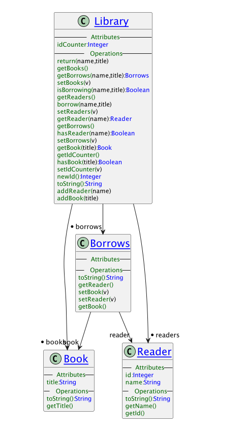
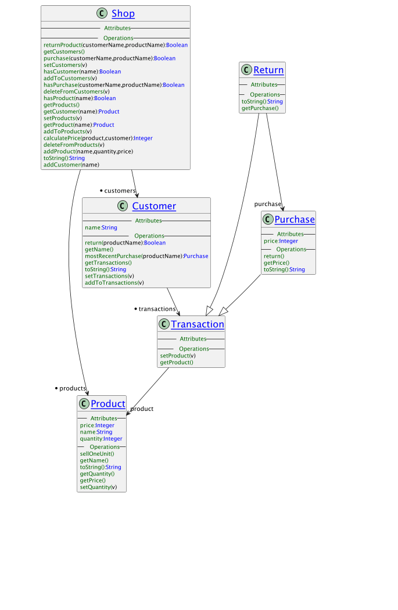

<p style="text-align: right;"></p>

# XEditor 

*Language Oriented Text Editing Powered by XMF and XOCL*

## Overview

__What is XMF?__ XMF is a language platform for working with text-based languages. XMF provides a high-level language called XOCL that offers a large number of useful language constructs. The XOCL data model is called XCore, everything written in XOCL - including XOCL programs - are defined by the XOCL data model. Furthermore, XCore can be extended (or even changed) making the XMF platform ideal for meta-programming: defining new language constructs.

__Why would anyone be interested in XOCL?__ Many languages such as Java and Python provide increasingly abstract programming constructs where implementation details are hidden from the programmer. This makes it easier to check the use of the constructs and makes the code easier to maintain. XOCL already has many such constructs and it is easy to add your own.

__Why would anyone be interested in meta-programming?__ Many languages such as Python and Java increasingly provide access to the type-level and expose platform execution mechanisms. This makes it easier to create adaptive systems. Access to programs-as-data within a programming environment makes it easy to create Domin Specific Languages and to create applications that consist of components written in languages appropriate to a range of domain experts.

__What is XEditor?__ XEditor provides a language-aware text editor for creating and interacting with XMF-based applications. XEditor provides access to XMF source files located in a folder structure, allows the files to be viewed and edited. The files can then be loaded into the XMF machine leading to new definitions or modifications to exiting definitions. The XEditor console provided interactive access to the current set of definitions.

XEditor is the sibling platform of [XModeler](https://le4mm.org). Both platforms are based on XMF , XCore and XOCL. XEditor builds text-based tools using XMF (with some associated graphics tooling), XModeler builds (multi-level) diagram-based tools using XMF (with some associated text tooling).

__What can I use XEditor for?__ The following types of application would be ideal for XEditor:

  - Prototyping data-rich applications.
  - Creating simulations.
  - Programming language research.
  - Reflective/Adaptive languages.
  - Teaching executable modelling.
  - Meta-modelling.
  - Domain Specific Languages.
  - Tooling for language support.

## Installation

Editor is open source and consists of several components, all of which can be downloaded from [This GitHub Repository](https://github.com/TonyClark/XEditor):

- com.ceteva.xmf.machine: A virtual machine and associated libraries written in Java.
- com.ceteva.xmf.system: The XMF system written in XOCL. XEditor provides access to the complete source code for the XMF system including its compiler and language processing systems. The XMF system can be modified by loading new definitions into a running system or by changing the source code and rebuilding a new image.
- com.ceteva.xmf.xeditor: The Java libraries that support the editor and its toolset.
- com.ceteva.xmf.projects: A collection of projects using Editor.

The machine and editor downloads are Eclipse projects which can be loaded into Eclipse and run as a Java application using console.Console as the main class.

Alternatively, the script `xeditor` in com.ceteva.xmf.xeditor can be used to start Editor from its parent folder.

## Editor Components

The XEditor consists of a file browser, file editor, menu bar, and an interactive console.

### File Browser


The XEditor file browser (shown on the left) which provides access to the files from a supplied collection of root folders. The XEditor is supplied with its own source code contained within the folder xmf-src. Normally the XEditor source folder will be one of the folders in the file browser. With the file browser you can:

  * Open and close folders using the mouse.
  * Open files for editing using mouse double-click.
  * Load files into XMF using the right-click menu on a file.
  * Create new files or folders using the right-click menu on a folder.
  
Files called Manifest.xmf are treated specially. They contain manifests that refer to folders and files. Loading a manifest causes XMF to load the files references by the manifest in the order that they occur.

### Editor Panel


The XEditor editor panel is shown to the right of the file browser and contains the currently selected file. The editor will be configured to understand the language of the file contents and to provide suitable functionality. Normally this is the XOCL language. With the editor panel you can:

  * Edit a file in the usual way.
  * Use Cmd-S to save a file that has been edited.
  * Use Cmd-C to copy selected text.
  * Use Cmd-V to paste copied text.
  * Use Cmd-Z to undo the last edit.
  * Use Cmd-X to delete the selected text.
  * Use Cmd-L to evaluate the file (using the compiler)
  
The editor panel is a right-click menu that provides access to:

  * Text zoom-in and zoom-out.
  * Changing the background colour of the editor panel.
  * Searching for text within the file.
  * Evaluating the selected text (either highlighted using the mouse or identified with red delimiters)
  
The editor-panel provides language-specific functionality applied to the file contents:

  * It checks the syntax. Errors are shown in the error-strip to the right of the panel.
  * It checks the semantics. Errors are shown in the error-strip to the right of the panel.
  * It provides menu items on the right-click menu.

### The Console

The XEditor console is used to interact with the current definitions loaded into the XMF machine. The initial state of a machine consists of the XOCL language and its associated libraries in addition to any initialisation files that have been loaded on startup. The console works by reading in an expression or a command and then printing out a result. If you type the name of any global named-element (defined in Root or XCore) then the console responds by printing out the value associated with the name. Typically the console is used to create or reference an object and then either reference the value of the object's slot or send the object a message. For example the following inspects the attributes slot of the object named Class:

```
[1] XMF> Class.attributes.name;
{
  constructors,
  isAbstract,
  attributes,
  resourceName}
[1] XMF> 
```

and sending a message:

```
[1] XMF> Class.allAttributes().name;
{
  bindings,
  constraints,
  default,
  constructors,
  imports,
  operations,
  isFinal,
  resourceName,
  name,
  parents,...}
[1] XMF> 
```

Notice the use of ... which means that the current pretty-printing length has been reached. This can be changed by:

```
[1] XMF> ?pp l 100
true
[1] XMF> Class.allAttributes().name;
{
  bindings,
  constraints,
  default,
  constructors,
  imports,
  operations,
  isFinal,
  resourceName,
  name,
  parents,
  contents,
  isAbstract,
  owner,
  grammar,
  documentation,
  attributes}
[1] XMF> 
```

The use of ?pp is an example of a top-level loop command. You can print out the documentation on the top-level commands using ?h:

```
[1] XMF> ?h
```

### Top Level Loop Help

The XMF top level loop is a command interpreter that reads
commands typed at a console, evaluates the commands and then
prints the result. The interpreter understands any valid XMF syntax
(such as XOCL) including language extensions that have been defined
using XBNF and accessed using '@'. When you type these commands
you must terminate them with a ';' before pressing return (note that
';' is the command terminator and commands may span several lines).
Note if a single quote (') is used in a command it should be part of
of a pair. If not, input will be halted until another one is entered.

The command interpreter has its own state: it remembers the most
recently evaluated values and the last error that occurred.
The variables v0, v1 and v2 are the last three values produced
by the top level. These variables can be useful when you want to
navigate to or compute a value and then use it in a subsequent
command. Errors may occur in commands typed at the top level.
When an error occurs, an exception is thrown and caught by the top
level loop. The loop then prints out error diagnostics. The value
of the variable xx is the most recently raised exception.

The XMF Console uses the Escape key as an interrupt. This can be
useful if you have caused XMF to enter an infinite loop or to start
a lengthy calculation that you wish to terminate. Interrupts are
handled by XMF on the next instruction cycle, the interrupt will
throw an exception.

The command interpreter has its own command language.
Each top level command starts with a '?'. Top level commands must
occur on a single line and are terminated by return rather than ';'.

### Top Level Commands

```
?ah                  Help on the syntax of patterns for ?a.
  
  ?a <PATTERN>         Named elements apropos the pattern. 
  
  ?cl [<FILE>]         Combines ?c and ?l.
   
  ?c <FILE>            Compile the file.
  ?c                   Compile the most recently compiled file.
   
  ?h                   Top level command help.
  
  ?i [+|-] <PATH>*     Import(+) or remove(-) a name space at the top level.
  
  ?l <FILE>            Load the binary file.
  ?l                   Load the most recently loaded binary.
  
  ?m (b|l|d|bl) [<Dir>] Build, load or delete manifest entries.
  ?m w <Dir> <File>     Write boot file based on manifest to file.
  ?m t <Dir> (s|b)      Touch binaries or sources.
   
  ?o                   Print out the current options.
  ?o saveSource bool   Toggle compiler saving source code.
  ?o sourcePos  bool   Toggle compiler saving source positions.
  ?o localNames bool   Toggle compiler saving local names.
  ?o checkTypes bool   Toggle compiler type checking code.
  
  ?pp                  Display the current pretty-printing settings.
  ?pp (d|l,p,r) <INT>  Set the pretty print depth, length, page or ribbon.
  ?pp (on|off)         Toggle pretty printing at the top level.
  ?pp x                Display the most recent exception in full.
  
  ?sh                  Start a dos shell. Enter exit to return.
  
  ?s <FILE>            Saves a system image in the file.
  ?s <FILE> <FILE>     Saves an image that boots from the second file.
  
  ?stats               Print machine stats.
   
  ?t <FILE>            Update the last write date of the file.
  
  ?x                   Exit current XMF level.
```

## The XMF Menu


The XMF Menu provides access to system-level functionality:

  * Compile is used to compile all of the system-level files contained in xmf-src.  If any of the *.xmf files are our of date with respect to the corresponding *.o then they are compiled.
  
  * Touch is used to make all *.xmf source files or all *.o files up-to-date. 
    By touching all the source files and then selecting Compile (above), 
    the entire system is recompiled.
  
  * Documentation is used to either generate all system documentation or to 
    view the documentation. The system documenation contains all packages that are  reachable from Root. The format of the documentation is HTML and is contained in the xmf-doc folder. 
  
  * Build is used to recreate the system images. The system images are contained in xmf-img. You should build the XMF image and then build the console image.  The XEditor boots from console.img. If you have changed any of the system files then you should recompile the system, rebuild the system and then restart XEditor.
  
  * Find displays a number of dialogs that can be used to interactively find 
    elements of the system.
  
  * Diagrams displays the interactive diagram tool.


## Basic XOCL

In general an XOCL file should have the following elements in order...
```
parserImport LanguageNameSpace;
```
The language name space is typically a package that defines syntax classes. A syntax class SC has a grammar and can therefore be used as @SC ... in the  body of this file. There can be any number of parser import declarations.
```
import ImportedNameSpace;
```
The imported name space is typically a package that contains class and operation definitions that are referenced by name in the body of the file. There can be any number of import declarations.

The body of the file starts here...
```
context NameSpace
   NamedElement
```
The named element (for example a class or an operation) is added to the name space when the file is loaded.

## Example Executable Models

There are example models in xmf-src/models:

  * A library model  

    Try running ```Models::Lib::test1()```

  * A shopping model 


## Snippets of Useful Information

#### Integers
```
// Some key integer operations. Browse XCore::Integer for more details.

// Conversions...
123.asFloat().println();
123.asSeq().println();
123.toString().println();

// Comparison...
123.max(100).println();
123.min(100).println();

// Modulo...
123.mod(2).println();

// Square Root...
123.sqrt().println();

// Sequence...
0.to(20).println();

// Character codes...

Root::a       := 97;
Root::A       := 97 - 26;
Root::one     := 49;
Root::newline := 10;
Root::space   := 32;

// Character predicates...

a.isAlphaChar().println();
a.isLowerCaseChar().println();
a.isUpperCaseChar().println();
A.isUpperCaseChar().println();
one.isNumericChar().println();
newline.isNewLineChar().println();
space.isWhiteSpaceChar().println();

// Random number ...

Integer::random(10).println();
```

#### Floats

```
// Some key float operations. Browse XCore::Float for more details.

// Coversion to integer...

12.3.ceiling().println();
12.3.floor().println();
12.7.ceiling().println();
12.7.floor().println();
12.7.round().println();

// Trigonometry...

45.0.cos().println();
45.0.sin().println();

// Creation from integers.

Float(10,5).println();
```

#### Booleans

```
// Some key boolean operations. Browse XCore::Boolean for more details.

true.booland(false).println();
false.boolor(true).println();
```

#### Strings

```
// Some key string operations. Browse XCore::String for more details.

// Size...
"a string".size().println();

// Conversion...
"true".asBool().println();
"123.45".asFloat().println();
"123".asInt().println();
"123".asSeq().println();
"123".asSet().println();
"abcdef".asSymbol().println();
"<x>body</x>".asXML().println();
"ABCDE".toLower().println();
"ABCDE".toUpper().println();
"|".print();"   xyz   ".stripWhiteSpace().print();"|".println();
"|".print();"   xyz   ".stripLeadingWhiteSpace().print();"|".println();
"|".print();"   xyz   ".stripTrailingWhiteSpace().print();"|".println();
"|".print();"*******xyz".stripNonAlphaChars().println();
"abcabc".subst("xxx","bc",true).println();
"abcabc".subst("xxx","bc",false).println();
"a>b>c>d>e>f".splitBy(Seq{">".at(0)},0,0).println();
"abcdefghijkl".subString(0,5).println();
"abcdefghijkl".truncate(5).println();
"abcdefghijkl".upperCaseInitialLetter().println();
"ABCDEFGHIJKL".lowerCaseInitialLetter().println();

// Indexing...
"12345".at(3).println();
"12345".indexOf("2",0).println();

// Files...
xmf.homeDir().println();
(xmf.homeDir() + "/xmf/init.xmf").fileExists().println();
(xmf.homeDir() + "/xmf/init.xmf").fileSize().println();
(xmf.homeDir() + "/xmf/init.xmf").isDir().println();
(xmf.homeDir() + "/xmf").isDir().println();
(xmf.homeDir() + "/xmf/init.xmf").isOlder(xmf.homeDir() + "/XMF/XMF.o").println();
(xmf.homeDir() + "/xmf/init.xmf").parentDir().println();
```

#### Vectors

```
Root::v := Vector(5);

v.put(0,10);
v.put(1,11);
v.put(2,12);
v.put(3,13);
v.put(4,14);

v.println();

v.ref(2).println();
v.indexOf(12).println();
v.size().println();

v.asSeq().println();
```

#### Files

```
// Get the contents of a file...

@XOCL::WithOpenFile(fin <- xmf.homeDir() + "/xmf/init.xmf")
  let size = (xmf.homeDir() + "/xmf/init.xmf").fileSize() then
      chars = Vector(size)
  in fin.read(chars);
     chars.asString().println()
  end
end;
```

#### Building a New Image

XEditor runs by loading an XMF image into the the XMF virtual machine. An XMF image is created by loading compiled XOCL files into an empty machine and then saving the machine state into an image file. 

The XEditor provides access to the complete source code written in XOCL so you can change any feature, recompile the system and then rebuild it in order too hange how fundamental features work. In addition, you can easily add additional features into the XEditor image.

Building the system can be performed under program control and is supported through the XMF menu. In order to create a new image you should follow the steps:

1. If you want to recompile the entire system use `XMF -> Touch -> Source` to update the file-write-date for all files.
2. Use `XMF -> Compile` to ensure that all source files are translated to `.o` files. Note that any compilation errors will cause the process to terminate and must be fixed before repeating this step.
3. Use `XMF->Build->XMF` to build a kernel image. 
4. Use `XMF->Build->Console` to extend the kernel image with the XEditor implementation. The resulting image is created in `com.ceteva.xmf.system/images`.
5. Restart XEditor in order to boot from the newly created image.

__NB__ Since the compiler is part of the saved image, you should keep a copy of `com.ceteva.xmf.system/images` in order to revert to a previous version if an image becomes corrupt.

#### System Manifest and Boot

The files `xmf-src/Manifest.xmf` and `Boot/BootConsole.xmf` are important. XMF uses manifest files to define the order of files and sub-directories when recompiling and loading binary files into the system. 

Modify `xmf-src/Manifest.xmf`  to define the list of files and sub-directories that are included when recompiling the complete system.

Modify `Boot/BootConsole.xmf`  to define the list of files and sub-directories loaded into a new image.

Note that __both__ of these files must be modified in order to define the system build. Under normal circumstances, user-level definitions should be defined in a folder containing a single manifest file.

#### System Images

You can save the current state of the system as an image. The operation
```XMF::saveState``` takes a file and an operation of one argument. The operation is called with the command line arguments when the image restarts. XMF is in control of the Console application and therefore must start it up before the operation returns. The saved image must be used as the boot image at startup. Typically images are found in ```com.ceteva.xmf.system/xmf-img/...```
```
xmf.saveState(xmf.homeDir()+"/example_image.img", 
  @Operation(initArgs) 
    format(stdout,"Restart~%",[]);
    Root::Console := xmf.javaClass("console.Console");
    // Create the console...
    Console();
    // Create the browser tree. This is set as part of the image creation in BootConsole.xmf
    Console.CONSOLE.setRoot(XEditor::getBrowserTree(Root))
  end);
  ```


> Written with [StackEdit](https://stackedit.io/).
